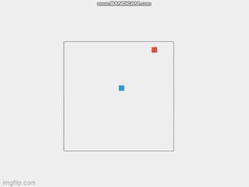

# Snake Game using jQuery

A classic Snake game implemented using jQuery, HTML, and CSS.

## Demo

## Gettig Started

To play the game, simply open `index.html` in a web browser with JavaScript enabled.

## How to Play

- Use the Arrow keys to control the snake's direction.
- Your goal is to eat the red dots to grow longer.
- Avoid running into the walls or colliding with your own tail.

## Known Issues

- THe snake's length doesn't inrease when coliding with food.
- The game doesn't end when the snakes collides with the game container's border or itself.
- Scoring feature is not yet implemented.

## Contributing
Contributions are welcome! Here are some aress where contibutors can help:
1. **Fixing Snake Length Issue:** Inestigate and fix the issue with the snake's length not increasing correctly when colliding with food.
2. **Game Over Conditions:** Implement logic to end the game when the snake collides with the game containers's border or itself.

3. **Scoring Feature:** Add a scoring mechanism to keep track of the player's score.

To contribute:
1. Fork the repository
2. Make your changes in a new branch
3. Submit a pull request.

 This is licensed under the MIT License.

 ## Author

 - Alden Derf